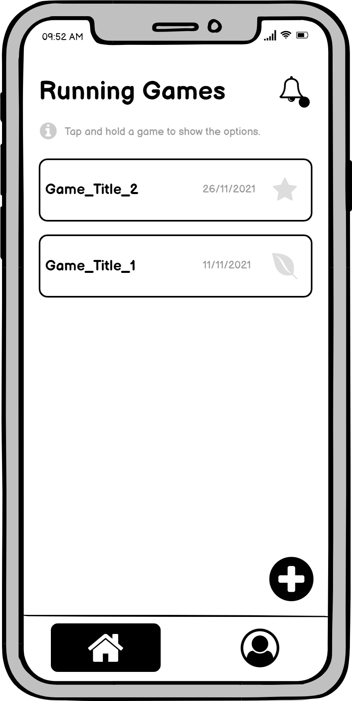
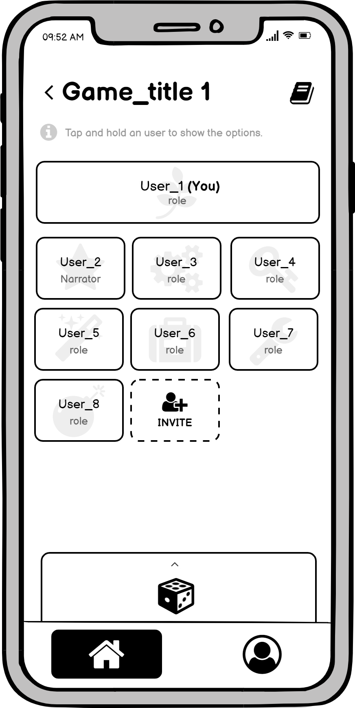

# Milestone 3: Wireframe - [roll4initiative]

## Wireframe
To address this purpose we leveraged Balsamiq to merge the interfaces of the two prototypes in M2. We focused on the main approach of prototype 1, "game setup", and considered the advice derived from evaluations to fix its interaction issues.  
We chose the "Voice call" wireframe because it where the main activity of our webapplication is performed, it gives access to the majority of the functionalities like communicating and managing the communication with other players as well as sharing game assets (dice, manuals...).

In the wireframes, additional screenshots have been added to show some graphic feedbacks or important pop-ups of the screens, based on the role of the user in the specific game session.

## Homepage

*Homepage screen: where you can access all your running games and/or create new ones. The **icon** in each game tile shows your role in the game. From the **bell icon** you can browse through the invitations you have received therefore accept or decline them.*
## Voice call
### Game_Title_1 (user is not narrator)
 

*Voice Call screen: here all the users that have joined the game are shown along with their role (icon and name). From the **invite icon** you can invite new players in the game. From the **manual icon** (top-right) you can access all the shared assets needed during the session. From the **dice icon** (bottom) you can open a screen where you can roll different type of dices (if necessary) and browse thorugh the history of all the dices rolled during the session.*

.png "Voice call campaign (Speaking feedback)")
*This screen shows the visual feedback of a speaking user (outline)*

### Game_Title_2 (user is narrator)
 

.png "Voice call campaign (Options)")
*This screen shows the option modal that the narrator can access to when they tap and hold on another **user tile**. The three options available are:*
- ***change role**: allows to change the role of a user;*
- ***mute**: disable the microphone of a user;*
- ***kick out**: to kick out a user from the game;*

.png "Voice call campaign (Options of Narrator)")

*This screen shows the option modal that the narrator can access to when they tap and hold on **their own tile**. The three options available are:*
- ***change role**: allows to change their role and assign the narrator role to another user;*
- ***mute**: disables their microphone;*
- ***Narration Mode**: disables all users microphone except their own;*

### Narration mode (view from generic user)
 

.png "Voice call campaign (Narration mode)")

*Narration Mode screen: this screen shows the visual feedback of the narration mode from a generic user point of view.*

