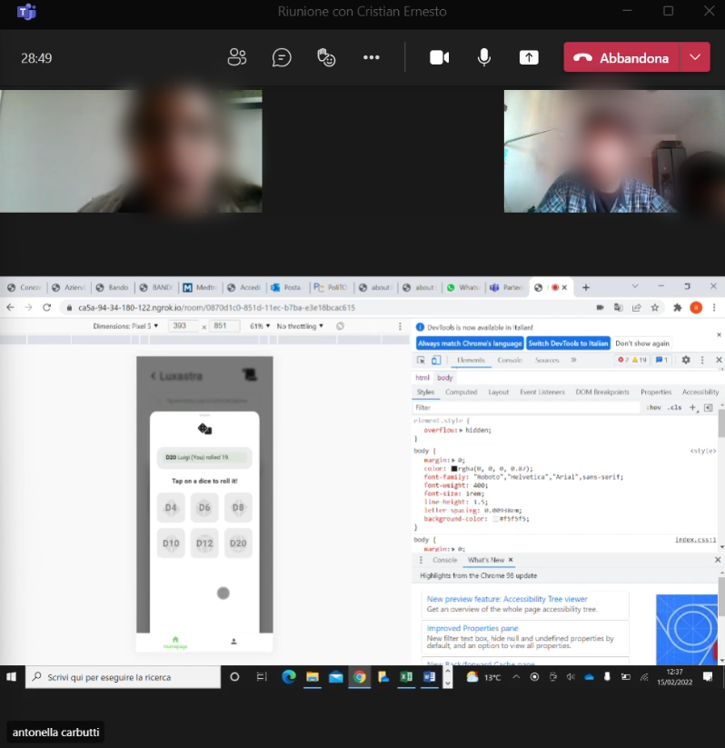
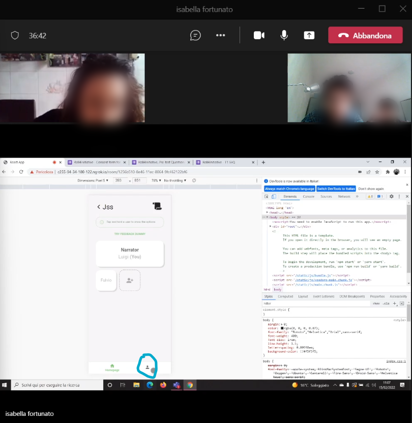
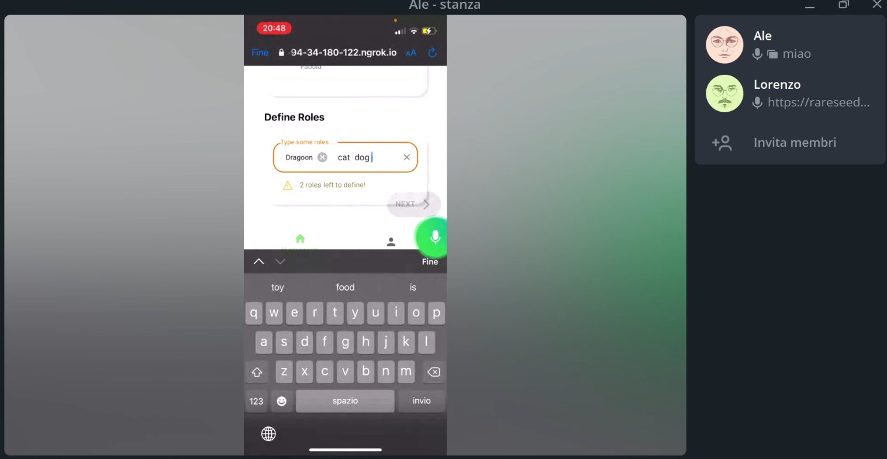

# Milestone 4: Usability Testing - [roll4initiative]

## Overview and Script
Usability testing was conducted online using ngrok, in order to run our web app on the participants devices. We did it online to better approximate the target population (the 5 people we found perfectly fit our target and they were outside Turin). They shared the screen with a video-call app (discord or teams).
Since our app needs interaction between multiple users, we charged a placeholder person just to enter the game room with the task of impersonating another user in the game.
As mentioned before, we have done five tests following this script:

[Usability Testing Script](resources/UsabilityTesting.pdf)

## Results and List of Changes

### Result:

| Task  |  Success | Critical | Not Critical | Time Average |
|-------|--------- |----------|--------------|--------------|
|  T1   |    80%     |     20% |    0%     |     54.6s   |
|  T2   |    80%     |     0%    |       20%     |     -      |
|  T3   |    60%     |     20%    |      20%     |     -       |
|  T4   |    100%     |     0%    |      0%      |    -      |
|  T5   |    100%   |     0%    |      0%        |     -      |
|  T6   |    40%     |     60%   |      0%       |     (*)      | 
|  T7   |    100%     |     0%     |     0%     |     8s       |
|  T8   |    80%     |     20%    |      0%     |     -       |
|  T9   |    100%     |     0%    |      0%     |     7.2s       |
|  T10  |    100%     |     0%    |      0%     |     5s       |
|  **TOT AVERAGE**  |    84%     |     12%    |      4%     |     -       |

(*) No average time because 3/5 testers failed the task.

### Results of T1 SEQ QUESTIONNAIRES:
https://docs.google.com/forms/d/1lfiph9bRe4rNP0loiWSM49ZthzCFLhYi7OLw5f7YN7k/edit?usp=sharing

### Results of T7 SEQ QUESTIONNAIRES:
https://docs.google.com/forms/d/1MiQcelcLtJKv3xwD6l7oquvw7QmmfUwquBWy2VguZDU/edit?usp=sharing

### At the end, we obtained this scores from the **SUS QUESTIONNAIRE**:

https://docs.google.com/forms/d/1GNLJDxpiHUNXwzAKwLMOzDsbg-Ecdm5xjQEcHN0meF8/edit?usp=sharing

1) 95
2) 92,5 
3) 67,5
4) 95
5) 72,5  
#### Arithmetic average : 84,5.

### Successful tasks: 
1. The participants had no problems moving through each screen of our web app, they seemed to find very natural the actions needed to access in all the different screens (join a game, create a game, etc...);
2. The set up of a game room went mostly smooth for all of the participants, in particular all the feedback we implemented, for each input field in order to prevent errors, were actually useful;
3. In the game room screen every icon perfectly communicated its purpose (document button, dice drawer), therefore the participants had no problem with performing the tasks like opening the dice drawer and rolling a dice or uploading and reading a game asset.

 
*Dice roll: the tester succesfully recognized the dice drawer and succesfully rolled a dice.*

### Pain points: 
1. The users were unable to mute themselves and others players because they did not perform the "tap and hold" interaction. The same action (show options) in the previous screen is currently done by just tapping: this inconsistency confused some of the testers.

*Mute: the tester did not know how to mute indeed she clicked another button.*

2. A few participants had some hard time recognising the possibility to define custom roles. Moreover when they realised that this possibility was actually avaiable, they could not sumbit the role intuitively (one of them expected the "space" input to submit the custom role).

*AutoComplete: the tester did not know how to confirm multiple custom roles.*

3. A tooltip in the game screen partially hid the options. 

### What we discovered and learned about our prototype:
1. Our users did not seem to read all the information provided by the app in order to use it, unless strictly necessary; but mostly they sticked to the standard way to use the other ones.
2. Warning/error colours (orange or red) effectively captured the attention of our users.
3. The autocomplete textboxes sometimes give the impression that the inserted text is constrainted to be one of the showed hints.
4. Providing multiple ways to navigate through the app (i.e back icon and homepage icon in the navigation bar)  actually allows the users to find their favourite and faster way to browse through the screens.
5. Selecting a more pleasing color makes the experience more enjoyable. (As pointed out from a tester during the debriefing session).

### List of potential changes:
- Allow players to use a "show of hands" function in order to draw the attention of the narrator during the narration mode. (One tester expressed the expectation that this functionality was present during the debriefing ).
- Prevent the autocomplete texts to show as soon as the users start to type in order to convey the idea of a suggestion instead of an option.(**2nd Pain point**)
- More appealing tutorial in order to catch the attention of a user.(**1st point discovered about our prototype**).

### List of fixed issues:
- Selected more captivating color in the entire UI. (**From debriefing**)
- Allowed the user to interact by only tapping in all the web app, removed all "tap and hold" interactions. (**1st Pain point**)
- Improved autocomplete input mode for defining roles, to better communicate the possibility of adding custom ones. (**2nd Pain point**)
- Replaced the tooltip with an infobox to avoid covering the other options. (**3rd Pain point**)
